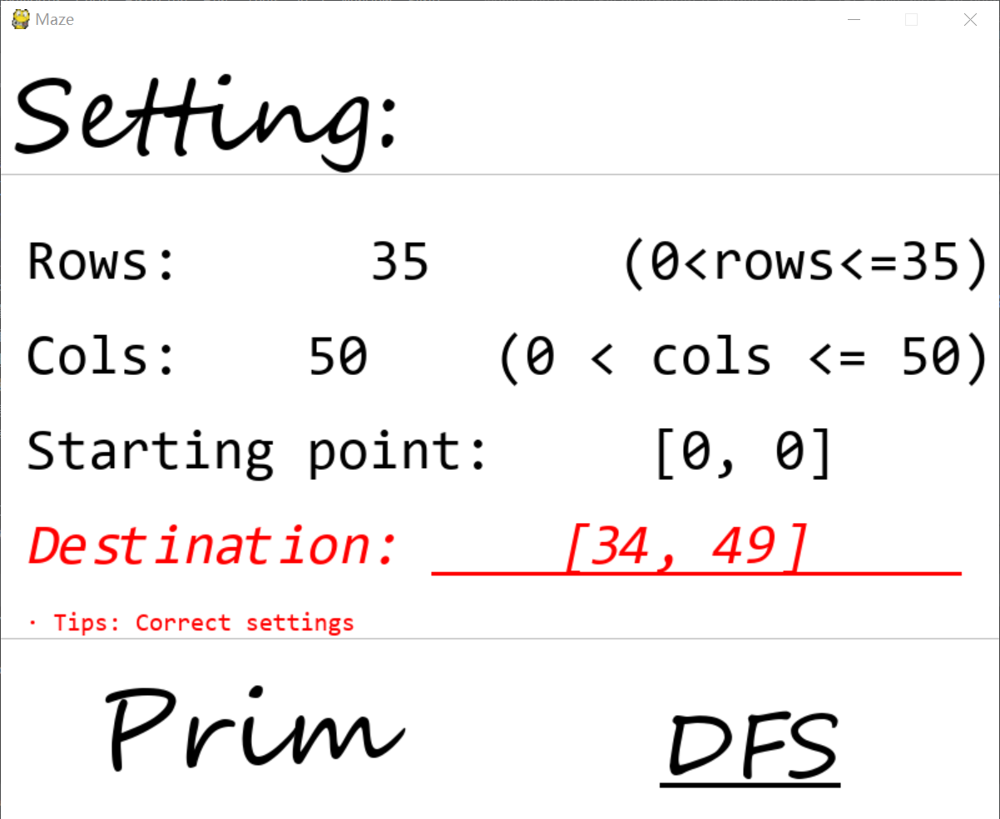
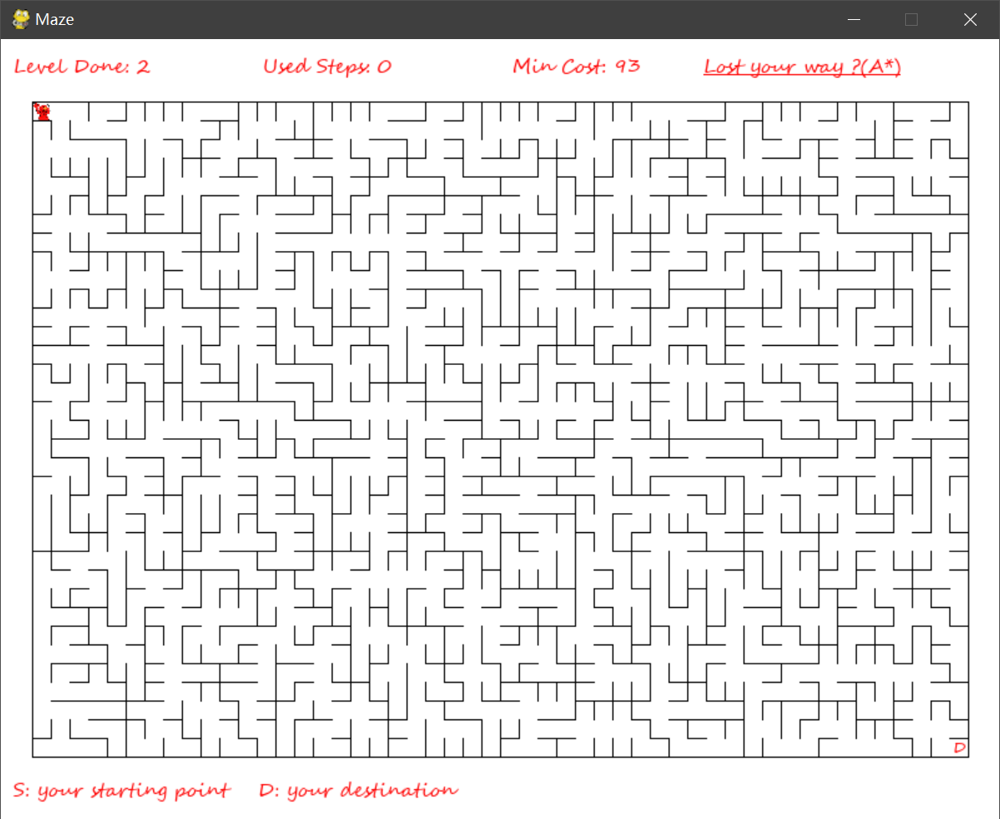
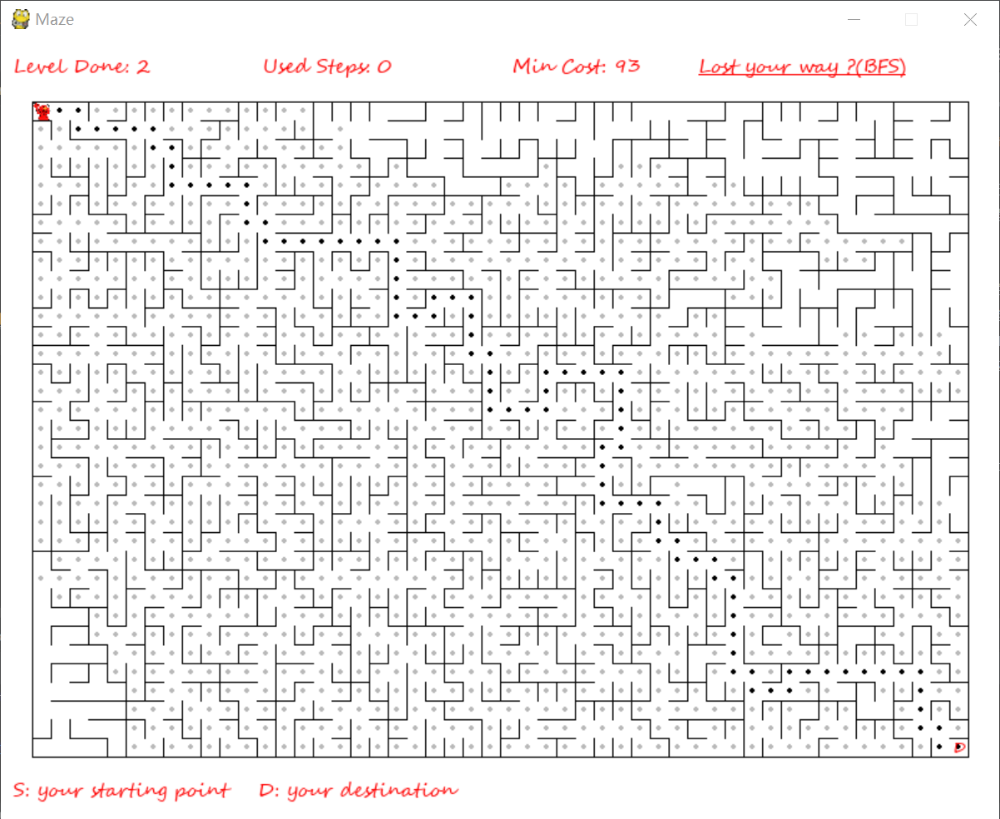
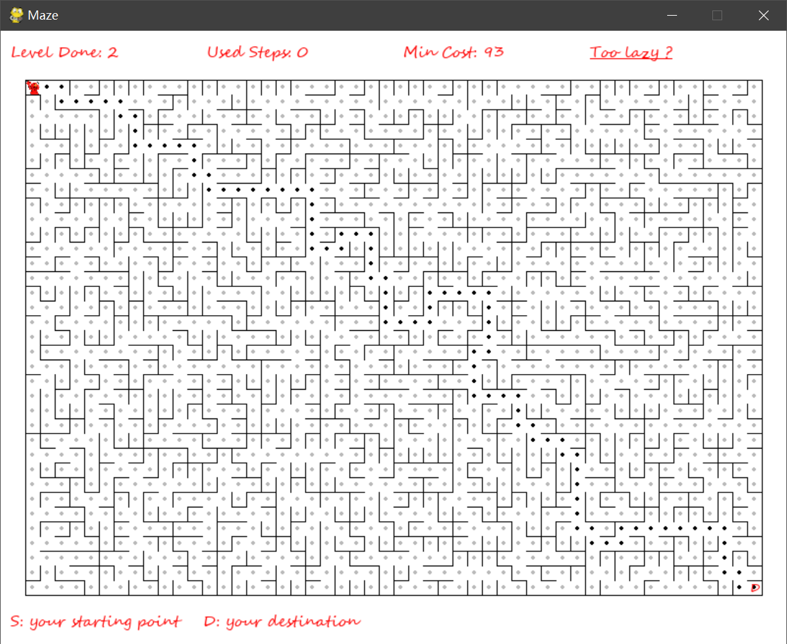
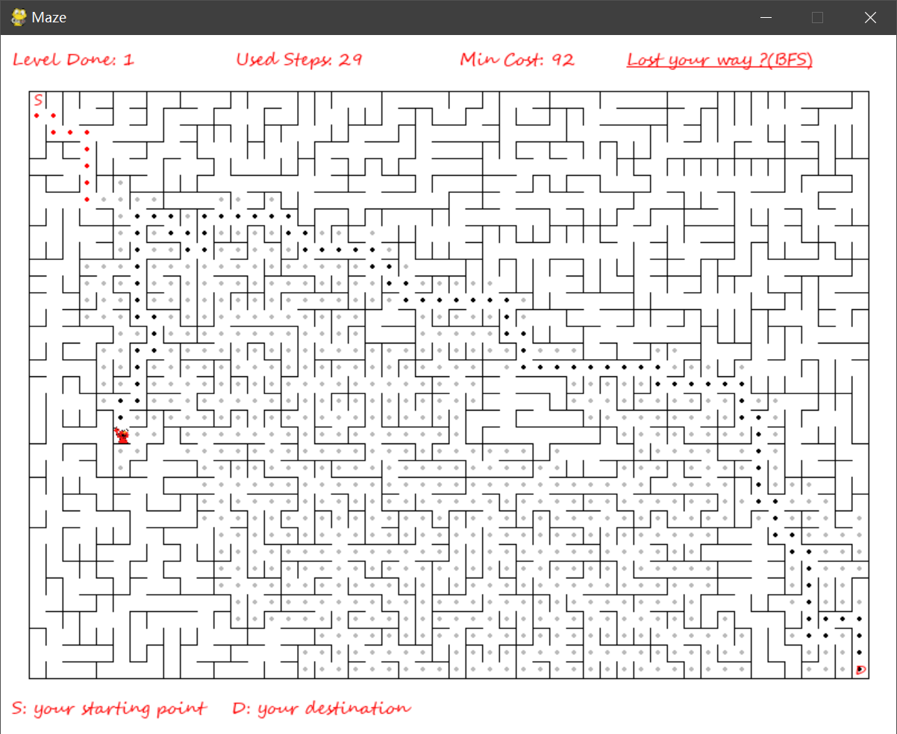
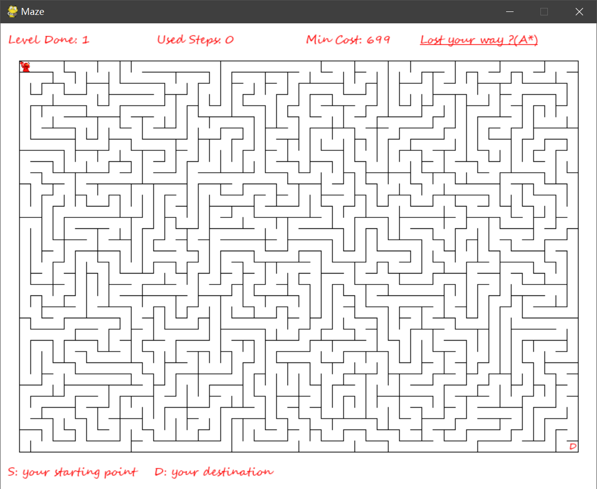
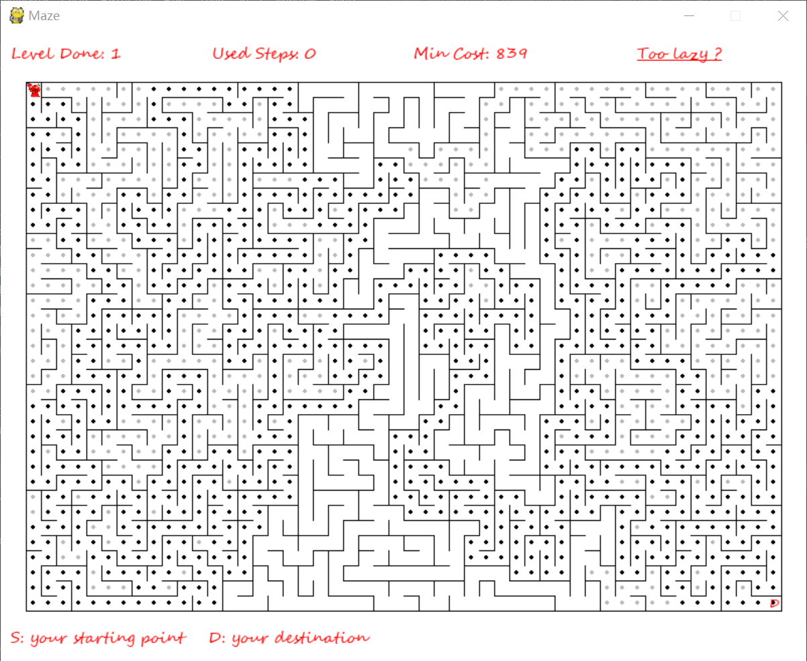

# Maze
> 数据结构实验作品，刚好练习一下python，自己学的实在太差劲了。
> 游戏是基于别人代码基础上进行更改的，只是为了完成作业，资源来源于网上，侵歉删<(＿　＿)>
[原作者迷宫游戏链接](https://github.com/CharlesPikachu/Games/tree/master/Game20)
## 实现功能
+ 用户可以设置迷宫的行数或列数
+ 随机产生迷宫的状态（Randomized Prim's algorithm，Recursive backtracking）
+ 用户设置入口下标和出口下标
+ 查询迷宫路径（A*，BFS）
## 算法
### 迷宫生成算法 [mazes.py](./modules/mazes.py)
[参考博客](https://blog.csdn.net/juzihongle1/article/details/73135920) [维基百科](https://en.wikipedia.org/wiki/Maze_generation_algorithm#Recursive_backtracker)
#### Randomized Prim's algorithm
1. 维基百科上的算法
    ```text
   This algorithm is a randomized version of Prim's algorithm.
    1. Start with a grid full of walls.
    2. Pick a cell, mark it as part of the maze. Add the walls of the cell to the wall list.
    3. While there are walls in the list:
        1. Pick a random wall from the list. If only one of the two cells that the wall divides is visited, then:
            1. Make the wall a passage and mark the unvisited cell as part of the maze.
            2. Add the neighboring walls of the cell to the wall list.
        2. Remove the wall from the list.
    It will usually be relatively easy to find the way to the starting cell, but hard to find the way anywhere else.
    Note that simply running classical Prim's on a graph with random edge weights would create mazes stylistically identical to Kruskal's, because they are both minimal spanning tree algorithms. Instead, this algorithm introduces stylistic variation because the edges closer to the starting point have a lower effective weight.
        这种算法是随机版本的Prim 算法。
        1. 让迷宫全是墙
        2. 选择一个单元格，使其成为迷宫的一部分，将它的邻墙加入列表
        3. 当列表不空时
            1. 从列表中随机选择一面墙，如果这面墙分离的两个单元格只有一个被访问过
               1. 打通这面墙，将未访问过的单元格标记访问
               2. 将这个单元格的邻墙加入列表
            2. 将这面墙从列表中移除
        这种算法找到通往起始单元的道路通常相对容易，但是其他单元格较难。
        请注意，在具有随机权重的图上运行经典Prim算法会产生跟Kruskal风格相似的迷宫，因为他们都是最小生成树算法。但是，此算法的变化在于，接近起点的边权重较低。
    
   Modified version
        Although the classical Prim's algorithm keeps a list of edges, for maze generation we could instead maintain a list of adjacent cells. If the randomly chosen cell has multiple edges that connect it to the existing maze, select one of these edges at random. This will tend to branch slightly more than the edge-based version above.
       改进版本
       虽然经典Prim算法维护的是一个边的列表，但是我们可以维护一个单元格的列表。如果随机选择的单元格有多个已在迷宫中相邻单元格，随机选择一个打通强。与基于边表的版本相比，这个版本会有更多分支。
    ```
2. 算法
    1. 生成全是墙的迷宫 选择初始单元格加入列表
    2. 当列表不为空时
       1. 从列表中随机选择一个单元格，标记访问（加入迷宫）并将其从列表中移除
       2. 检查当前单元格的邻格
           1. 如果有访问过的邻格，从中随机选择一个，打通两格间的墙
           2. 将不在列表中的邻格加入列表
2. 代码
    ```python
    def createMaze_Prim(maze_size, block_size, border_size):
        # ----生成全是墙的迷宫
        blocks_list = [[Block([col, row], block_size, border_size) for col in range(maze_size[1])] for row in
                       range(maze_size[0])]
        # ----将一个单元格加入列表
        block_now = blocks_list[0][0]
        records = [block_now]
        # ----当列表不空时
        while records:
            # ---随机取出一个单元格
            block_now = random.choice(records)
            # ---标记访问 加入迷宫
            block_now.is_visited = True
            # ---从列表中移除这个单元格
            records.remove(block_now)
            # ---检查相邻单元格 上下左右
            check = []
            c, r = block_now.coordinate[0], block_now.coordinate[1]
            check_list = [
                {'check': r > 0, 'coordinate': (r - 1, c), 'direction': 'Up', 'index': 1},
                {'check': r < maze_size[0] - 1, 'coordinate': (r + 1, c), 'direction': 'Down', 'index': 0},
                {'check': c > 0, 'coordinate': (r, c - 1), 'direction': 'Left', 'index': 3},
                {'check': c < maze_size[1] - 1, 'coordinate': (r, c + 1), 'direction': 'Right', 'index': 2}
            ]
            for item in check_list:
                # 如果单元格合法
                if item['check']:
                    # 如果该相邻单元格在已在迷宫中，记录该单元格
                    if blocks_list[item['coordinate'][0]][item['coordinate'][1]].is_visited:
                        check.append(item['direction'])
                    else:
                        # 否则 若该单元格不在列表中，加入列表
                        if not blocks_list[item['coordinate'][0]][item['coordinate'][1]] in records:
                            records.append(blocks_list[item['coordinate'][0]][item['coordinate'][1]])
            if check:
                # 从记录的相邻单元格中随机随机选择一个单元格 将中间的墙拆除
                move_direction = random.choice(check)
                for index, item in enumerate(check_list):
                    if item['direction'] == move_direction:
                        blocks_list[r][c].has_walls[index] = False
                        blocks_list[item['coordinate'][0]][item['coordinate'][1]].has_walls[item['index']] = False
                        break
        return blocks_list
    ```
#### Recursive backtracking
1. 维基百科上的算法
    ```text
    1. Choose the initial cell, mark it as visited and push it to the stack
    2. While the stack is not empty
       1. Pop a cell from the stack and make it a current cell
       2. If the current cell has any neighbours which have not been visited
           1. Push the current cell to the stack
           2. Choose one of the unvisited neighbours
           3. Remove the wall between the current cell and the chosen cell
           4. Mark the chosen cell as visited and push it to the stack
    1. 选择初始单元格，将其标记为已访问并将其推入堆栈
    2. 当堆栈不为空时
       1. 从堆栈中弹出一个单元格，使其成为当前单元格
       2. 如果当前单元格中有尚未访问的邻居
           1. 将当前单元格推入堆栈
           2. 选择一个未访问的邻居
           3. 删除当前单元格和所选单元格之间的墙
           4. 将所选单元格标记为已访问并将其推入堆栈
    ```
2. 代码
    ```python
    def createMaze_DFS(maze_size, block_size, border_size):
        # ----生成全是墙的迷宫
        blocks_list = [[Block([col, row], block_size, border_size) for col in range(maze_size[1])] for row in
                       range(maze_size[0])]
        # ----将一个单元格加入栈 标记访问 并入栈
        block_now = blocks_list[0][0]
        block_now.is_visited=True
        records = [block_now]
        # ----当栈不空时
        while records:
            # ---从堆栈中弹出一个单元格，使其成为当前单元格
            block_now=records.pop()
            # ---检查当前单元格的相邻单元 记录未被访问过的
            check = []
            c, r = block_now.coordinate[0], block_now.coordinate[1]
            check_list = [
                {'check': r > 0, 'coordinate': (r - 1, c), 'direction': 'Up', 'index': 1},
                {'check': r < maze_size[0] - 1, 'coordinate': (r + 1, c), 'direction': 'Down', 'index': 0},
                {'check': c > 0, 'coordinate': (r, c - 1), 'direction': 'Left', 'index': 3},
                {'check': c < maze_size[1] - 1, 'coordinate': (r, c + 1), 'direction': 'Right', 'index': 2}
            ]
            for item in check_list:
                if item['check'] and not blocks_list[item['coordinate'][0]][item['coordinate'][1]].is_visited:
                    check.append(item['direction'])
            # ---存在未被访问的邻格
            if check:
                # ---当前单元格入栈
                records.append(block_now)
                # ---随机选择邻格
                move_direction = random.choice(check)
                for index, item in enumerate(check_list):
                    if item['direction'] == move_direction:
                        # ----拆除墙
                        blocks_list[r][c].has_walls[index] = False
                        blocks_list[item['coordinate'][0]][item['coordinate'][1]].has_walls[item['index']] = False
                        # ----标记访问
                        blocks_list[item['coordinate'][0]][item['coordinate'][1]].is_visited=True
                        # ----入栈
                        records.append(blocks_list[item['coordinate'][0]][item['coordinate'][1]])
                        break
        return blocks_list
    ```
### 迷宫寻路算法 [pathfingding.py](./modules/pathfinding.py)
[参考博客](https://blog.csdn.net/Dog_dream/article/details/80270398) [A*算法参考博客](https://blog.csdn.net/diamonjoy_zone/article/details/65630144) [A*算法维基百科](https://en.wikipedia.org/wiki/Breadth-first_search) [BFS算法维基百科](https://en.wikipedia.org/wiki/Breadth-first_search)
#### A* search
#### Breadth-first search
## 实验记录
1. 任务记录
    + 配置文件
    + 界面初始化
    + 其他模块
    + 游戏精灵
    + 迷宫生成算法
    + 搜索路径算法
## 运行截图









## 实验报告
1. 封面
2. 成员分工
3. 数据结构
4. 算法阐述
5. 函数 类 调用关系
6. 核心函数流程图 
7. 运行截图 功能截图
8. 实验总结 难点总结
9. 谢谢
至少15页